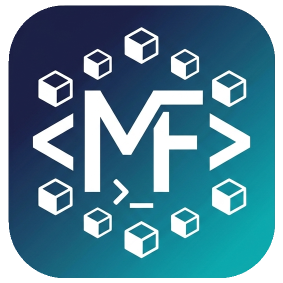

# MF Lab

<p align="center">
  
</p>

<p align="center">
  <strong>Öğrenciler için Tek Tıkla Ders Ortamı Kurucusu ve Yönetim Aracı</strong><br>
  <em>Geliştirici & Eğitmen: Mustafa Fenerci</em>
</p>

<p align="center">
  <a href="https://github.com/mustafafenerci/mflab/actions/workflows/ci.yml"></a>
  <a href="https://github.com/mustafafenerci/mflab/releases/latest"></a>
  <a href="https://github.com/mustafafenerci/mflab/pkgs/container/mflab-php-web"></a>
  <a href="LICENSE"></a>
  
</p>

---

## 💡 MF Lab Nedir?

**MF Lab**, üniversite ve lise öğrencilerinin yazılım dersleri için gereken karmaşık ortamları (Apache, PHP 8.3, MariaDB, PostgreSQL, Composer, Git, Node.js, VS Code ve eklentileri) **tek bir tıkla, bilgisayarlarını kirletmeden ve neyin neden kurulduğunu öğrenerek** kurmalarını sağlayan modern bir Windows masaüstü uygulamasıdır.

### ✨ Temel Özellikler
* 🐳 **Docker İle Temiz Sistem:** Web sunucusu ve veritabanları izole Docker konteynerlerinde çalışır. Bilgisayarınızda çakışma yaratmaz, sisteminizi yormaz.
* 🛡️ **Çakışmasız Port Standardı (63xx Serisi):** Bilgisayarınızda yerel MySQL, SQL Server veya IIS olsa dahi çakışma yaşanmaz. Tüm servisler garanti `63xx` port serisinde çalışır.
* 📂 **Kalıcı Çalışma Klasörleri:** Yazdığınız tüm kodlar (`htdocs` vb.) ve veritabanı tablolarınız Windows üzerinde `C:\MFLab` dizininde güvende kalır.
* 🚀 **Çoklu Proje & Haftalık Ders Portalı:** `htdocs` içindeki tüm haftalık ödev ve alt projeler dinamik MF Lab Öğrenci Portalı (`index.php`) ve masaüstü arayüzünden tek tıkla listelenir, taranır ve tarayıcıda/VS Code'da açılır.
* 📦 **Tek Tıkla Ödev Paketleme (.ZIP):** İlgili haftanın projesini ve MariaDB/PostgreSQL veritabanı yedeğini (`veritabani.sql`) tek tıkla standart adlandırmayla (`No_AdSoyad_Ders_Proje.zip`) masaüstüne paketler.
* 🗄️ **Hazır Eğitim Veritabanları:** Öğrenci Not Sistemi, E-Ticaret Demo ve Kütüphane Veritabanı tabloları tek tıkla veritabanınıza yüklenir.
* 🔔 **Sistem Tepsisi (saatin yanı):** MF Lab simgesine sağ tıklayınca kurulu servisleri, durumlarını (çalışıyor/durdu) ve hızlı işlemleri (başlat/durdur, siteyi aç, VS Code, terminal) görürsün. Servisler çalışırken pencereyi kapatırsan uygulama tepsiye iner; tamamen çıkmak için menüden **Çıkış**'ı seç.
* 🌐 **Web Tasarımı Projelerim:** Her ödev/hafta için ayrı proje klasörü (index.html, style.css, script.js ve açıklamalı README hazır gelir). Her proje tek tıkla tarayıcıda **canlı önizlenir**: dosyayı kaydedince sayfa kendiliğinden yenilenir (Live Server gibi, ek kurulum gerekmez). VS Code içinde önizleme için Microsoft **Live Preview** eklentisi kurulur; eski Live Server eklentisi karışıklık olmasın diye kaldırılır.
* 🔄 **Tek Tıkla Güncelleme:** Yeni sürüm çıkınca uygulamanın üstünde "Şimdi güncelle" düğmesi görünür; dosya indirilir, GitHub'daki SHA-256 özetiyle doğrulanır ve kurulur. MF Lab kısa bir süre kapanıp yeni sürümle açılır.
* 👥 **Ortak Laboratuvar Bilgisayarları:** Her Windows kullanıcısının projeleri `C:\MFLab\<kullanıcı>` altında ayrı tutulur ve yalnızca o kullanıcı erişebilir; aynı bilgisayarı kullanan öğrenciler birbirinin ödevini görmez. (Eski sürümden kalan veriler taşınmadan yerinde kullanılmaya devam eder.)
* 🚀 **Windows Açılınca Başlat (isteğe bağlı):** Hakkında → Ayarlar'dan açılırsa MF Lab bilgisayar açılınca pencere açmadan saatin yanında başlar.
* 🧹 **Temiz Kaldırma:** Kaldırırken çalışan ders servisleri durdurulur; projelerin ve veritabanlarının silinip silinmeyeceği sorulur (varsayılan: korunur).
* 🧪 **Ön Kontrol:** Kurulumdan önce Windows sürümü, RAM, disk, BIOS sanallaştırması, WSL 2, bekleyen yeniden başlatma, Docker modu (Linux/Windows) ve Docker Hub/GitHub erişimi otomatik kontrol edilir; eksik olan Türkçe ve adım adım anlatılır. Docker yanlış moddaysa Linux moduna kendisi geçer.
* 🩺 **Port Doktoru & Sistem Bakımı:** 63xx portlarını test ederek olası çakışmaları anında tespit eder; tek tıkla Docker disk alanını temizler.
* 🖥️ **Masaüstü Kısayolları:** Kurulum tamamlandığında masaüstünüze doğrudan ilgili klasörü açan, VS Code'u başlatan ve phpMyAdmin/pgAdmin panellerine giden hazır kısayollar bırakılır.
* 🔍 **Pedagojik ve Anlaşılır:** Her paketin yanında *"Bu yazılım neden kuruluyor?"* açıklaması bulunur. Hata durumunda neden kaynaklandığı ve çözüm yolu gösterilir.
* ⚙️ **Kalıcı Ayarlar:** Öğrenci adı, tema tercihi ve son açılan ders bilgileri `C:\MFLab\settings.json` dosyasında güvenle saklanır.

---

## 🎓 Desteklenen Dersler ve Servis Portları (v1.1.8)

| Ders | Bileşenler | Portlar | Masaüstü Klasörü |
| :--- | :--- | :--- | :--- |
| **Web Tasarımı** | VS Code + HTML, CSS, JavaScript, Live Server eklentileri | *(Docker gerekmez)* | `WebTasarimi` |
| **Web Programlama II** | Docker, VS Code, Git, Apache + PHP 8.3 + Composer + Node.js 22, MariaDB 11, phpMyAdmin | **Apache:** `http://localhost:6380`<br>**phpMyAdmin:** `http://localhost:6381`<br>**MariaDB:** `localhost:6306` | `WebProgramlama2` |
| **Veritabanı Yönetim Sistemleri** | Docker, VS Code, PostgreSQL 16 + pgAdmin 4, MariaDB 11 + phpMyAdmin | **PostgreSQL:** `localhost:6332`<br>**pgAdmin:** `http://localhost:6350`<br>**MariaDB:** `localhost:6307`<br>**phpMyAdmin:** `http://localhost:6382` | `VTYS` |

---

## 📥 Öğrenciler İçin Kurulum (Hızlı Başlangıç)

### Yöntem 1: Kurulum Dosyası İle (Önerilen)
1. **Setup Dosyasını İndirin:**  
   [👉 **En Güncel Sürümü İndir (v1.1.8)**](https://github.com/mustafafenerci/mflab/releases/latest) — sayfadaki `MFLab-Setup-vX.Y.Z.exe` dosyasına tıklayın; dosya adındaki `vX.Y.Z` sürüm numarasıdır.
2. **Kurulumu Başlatın:**  
   `MFLab-Setup-vX.Y.Z.exe` dosyasını çalıştırın ve kurulum sihirbazını tamamlayın. Kurulum bitince MF Lab otomatik olarak açılır.
3. **Dersinizi Seçin ve Kur'a Basın:**  
   Masaüstündeki **MF Lab** kısayolundan uygulamayı açın, aldığınız dersi seçip **"Kur"** butonuna basın.

### Yöntem 2: Tek Komutla PowerShell Kurulumu (Laboratuvarlar & Hızlı Kurulum)
Windows PowerShell'i açıp şu komutu yapıştırmanız yeterlidir:
```powershell
irm https://raw.githubusercontent.com/mustafafenerci/mflab/main/scripts/install.ps1 | iex
```

> **Not (Docker Desktop):** Web Programlama ve Veritabanı dersleri için bilgisayarınızda [Docker Desktop](https://www.docker.com/products/docker-desktop/) kurulu ve çalışır durumda olmalıdır. Docker kurulu değilse MF Lab sizi otomatik olarak bilgilendirir.

### ⚠️ "Windows kişisel bilgisayarınızı korudu" Uyarısı

`MFLab-Setup-vX.Y.Z.exe` internetten indirilip çift tıklandığında Windows şu uyarıyı gösterebilir:

> **Windows kişisel bilgisayarınızı korudu** — Microsoft Defender SmartScreen tanınmayan bir uygulamanın başlamasını engelledi. Yayımcı: Bilinmeyen yayımcı

Bu bir **hata veya virüs uyarısı değildir.** MF Lab açık kaynaklıdır (kaynak kodu bu depoda) ve kurulum dosyası GitHub Actions ile herkesin görebileceği şekilde derlenir. Uyarı, dosyanın ücretli bir kod imzalama sertifikasıyla imzalanmamış olmasından kaynaklanır; indirilen her imzasız `.exe` bu uyarıyı alır.

**Kurulumu şöyle sürdürebilirsiniz (aşağıdakilerden biri yeterli):**

1. Uyarı penceresinde **"Ek bilgi"** yazısına tıklayın, ardından çıkan **"Yine de çalıştır"** düğmesine basın.
2. Ya da indirdiğiniz `MFLab-Setup-vX.Y.Z.exe` dosyasına **sağ tıklayın → Özellikler** → en altta **"Engellemeyi kaldır"** kutusunu işaretleyip **Tamam**'a basın, sonra dosyayı normal şekilde çalıştırın.
3. Ya da uyarıyla hiç karşılaşmamak için yukarıdaki **Yöntem 2 (PowerShell tek komut)** ile kurun. Bu yöntemle indirilen dosyada "internetten indirildi" işareti oluşmaz.

> **Güvenlik ipucu:** Kurulum dosyasını yalnızca bu deponun [Releases sayfasından](https://github.com/mustafafenerci/mflab/releases/latest) indirin. Başka bir yerden gelen `MFLab-Setup` dosyalarına güvenmeyin.

---

## 👨‍💻 Geliştiriciler ve Eğitmenler İçin

MF Lab, **Flutter Desktop (Windows)** ile geliştirilmiş olup arkasında Inno Setup ve GitHub Actions CI/CD otomasyonu barındırır.

### Yerel Ortamda Çalıştırma

```bash
# Bağımlılıkları yükleyin
flutter pub get

# Windows Desktop uygulamasını geliştirme modunda açın
flutter run -d windows

# Birim testleri çalıştırın
flutter test

# Statik analizi çalıştırın
flutter analyze
```

### Tek Tıkla Setup Derleme
Bilgisayarınızda [Inno Setup 6](https://jrsoftware.org/isinfo.php) kurulu ise:
```powershell
.\build_installer.ps1
# veya
.\build_installer.bat
```
Derlenen `MFLab-Setup-vX.Y.Z.exe` doğrudan Masaüstünüze (`Desktop`) kopyalanacaktır.

---

## 🤝 Katkıda Bulunma (Pull Request)

MF Lab açık kaynaklı bir topluluk projesidir. Üniversiteler, meslek yüksekokulları veya liseler için yeni ders ortamları, yeni Docker servisleri veya hata çözümleri eklemekten mutluluk duyarız!

1. Bu depoyu **Fork**'layın.
2. Yeni bir dal açın (`git checkout -b feature/yeni-ders`).
3. Değişikliklerinizi yapıp testleri çalıştırın (`flutter test`).
4. Bir **Pull Request** gönderin!

Ayrıntılı rehber için lütfen [CONTRIBUTING.md](CONTRIBUTING.md) belgesini inceleyin.

---

## 📜 Lisans

Bu proje **[MIT Lisansı](LICENSE)** ile lisanslanmıştır. Eğitim ve ticari amaçlarla serbestçe kullanılabilir, kopyalanabilir ve dağıtılabilir.

**Mustafa Fenerci** © 2026
